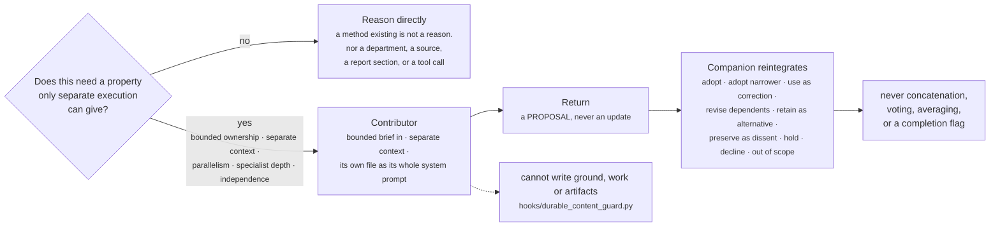

# ICS Product Companion

The ICS (Integrated Control Strategy) product-companion agentic system, realized
as an **ICS-prepared project workspace** hosted natively by `lc_factory` / `ddt-agent`.

There is no second agent application here. The host runtime is already the main agent, model loop,
session environment, tool executor, and subagent runtime. This workspace is what causes that
runtime to operate as the ICS product companion.

```text
Scientist
   ⇅
ddt-agent  (lc_factory.create_factory_agent)
   +
this prepared workspace — AGENTS.md, skills, subagents, references, connectors
   ⇅
Program sources, external science, specialists, and people
```

**To run it: [`RUNNING.md`](RUNNING.md).** This file is what it is and why.
**New to the project? Read the [complete system guide](docs/system-guide.md)** for
the architecture, a worked consultation, skills and contributors, evidence and
ICH guidance, tools, and persistent understanding.
**For a walkthrough: [`communication/overview.html`](communication/overview.html)** — open in a browser.

One workspace serves **one programme**. This one is bound to **MK-6070** — a DLL3-targeted T-cell
engager, historically HPN328, INN *gocatamig*. A second programme means a second workspace, not a
second directory here.

## What you can ask it

Its job is a *living, scoped scientific assurance argument* for why a defined product and process
configuration should achieve and maintain its intended quality through a justified collection of
controls. Six skills support four program-facing outcomes, bounded evidence work,
and explicitly requested exploration. The companion follows what you actually ask:

| If you ask | This owns it |
| --- | --- |
| How is this controlled? How does the control strategy work? Why does this control exist? Reconstruct the current account. | `establish-control-strategy-understanding` |
| Are the controls sufficient? Is quality assured? Where are the gaps? What could go wrong that isn't covered? Would this withstand inspection? | `assess-control-strategy-assurance` |
| This result is out of trend. What could explain it? What's the likely cause? How would I tell these two explanations apart? | `investigate-quality-concern` |
| We're changing site, scale, process, equipment, material, supplier, method or specification — what does it affect? Does prior validation still apply? Is this comparable? | `assess-change-impact` |
| What evidence would distinguish these explanations? Can existing data already answer this? What would this study actually establish? | `design-decision-changing-evidence` |
| Brainstorm with me. What assumptions should we challenge? Can we develop a different way of thinking about this? | `brainstorm` |

The first four are complete scientist-facing outcomes. The fifth is horizontal and bounded: the
others may invoke it, or you can ask it directly, and it never becomes a programme-level
conclusion on its own.

Invoke [brainstorm](.deepagents/skills/brainstorm/SKILL.md) with
`/skill:brainstorm <question>` in the intended host, or explicitly ask for scientific
brainstorming. The same companion develops possibilities, counterfactuals and
provisional positions with you. Public discovery, related articles and selective
methods/table reading can enrich or challenge an idea when useful. A new perspective
can be the endpoint; a later request for assessment changes the work's purpose.
Evidence and conjecture remain distinguishable throughout. See the
[conversation evaluations](evals/fixtures/brainstorm/README.md).

```text
              ┌───── four complete scientist-facing outcomes ─────┐

  establish-            assess-             investigate-       assess-
  control-strategy-     control-strategy-   quality-           change-
  understanding         assurance           concern            impact

  how it works       is it sufficient    what explains      what a state
                     / where are gaps    this observation   difference means

      │                     │                   │                  │
      └─────────────────────┴─────────┬─────────┴──────────────────┘
                                      │  invoked when an empirical
                                      │  uncertainty limits the answer
                                      ▼
                      design-decision-changing-evidence
                  ───────────────── horizontal ─────────────────
                  bounded either way: invoked by an outcome, or
                  asked directly. Never a programme conclusion.
```

Composing is not routing. A skill that only delegates has failed, and the companion may reason
directly without invoking any of them.

**What it will not do**, on its own initiative: confer blanket adequacy, comparability or
approval status; convert a potential gap into a failure, deviation, risk score or required remediation;
establish accepted root cause, product impact or batch disposition; create or close an
investigation, CAPA or change control; approve a protocol or release results; or fabricate
programme-specific effects, ranges, thresholds or acceptance criteria. A precise limitation or an
inconclusive result is a legitimate endpoint.

## ICH guidance in the scientific work

The existing skills use [applicable ICH principles](references/control-strategy-guidance.md)
to examine controls, analytical evidence, priorities, and proposed changes. The
[source index](references/ich-source-index.md) identifies official editions,
sections, and scope. Read relevant material on demand; guidance does not establish
program facts or authorize action. Supported favorable conclusions and conditional
scientific recommendations are valid outcomes.

[Offline consulting packets](evals/fixtures/ich-guidance/README.md) exercise these
distinctions with synthetic evidence and separate reviewer rubrics. They are not
live-program evidence or proof of host-runtime performance.

## Layout, and why each part exists

```text
AGENTS.md                     companion identity + shared scientific operating contract
                              (auto-loaded into the system prompt every session)
.deepagents/
  skills/<name>/SKILL.md      6 skills, progressively disclosed
  agents/<name>/AGENTS.md     4 bounded contributor roles
  hooks.json                  PermissionRequest matchers -> hooks/
references/                   shared contracts and ICH guidance, read on demand
workspace/programs/MK-6070/   the programme continuity boundary
  PROGRAM.md                  coordinate, typed identifiers, scope limits, recovery index
  ground/ work/ artifacts/    continuity of understanding / activity / work products
config/program-scope/         per-source programme filter mappings (adapter-enforced)
auth/                         MUSE SESSION capture and keepalive
hooks/                        durable_content_guard.py — enforcement the prompt cannot do
tools/                        2 MCP connectors, 8 offline harnesses + their suite runner, one
                              live contract check, probe client, scope regenerator, mutation
                              gate, pre-commit scan
evals/                        core fixtures, ICH consulting packets/rubrics, pinned scope fixture
.mcp.json                     connector registration
```

`AGENTS.md` carries what must always be active. `references/` carries the detail that would
otherwise be duplicated across the skills. Skills carry the characteristic reasoning of one
scientific outcome. That split is the point: it keeps the skills from re-specifying evidence,
state, correction, assurance and authority discipline in each skill.

Four layers, loaded four different ways:

```text
  AGENTS.md          ALWAYS ON      in the system prompt every session
       │                            the contract that must never need looking up
       │  points to
       ▼
  references/        ON DEMAND      opened by what you are holding, not preemptively
                                    evidence, state, materialization, correction,
                                    assurance, search guides, and ICH references
       ▲
       │  cite the same references
       │
  .deepagents/skills/               PROGRESSIVELY DISCLOSED
                                    one skill per scientific outcome, read when invoked

  .deepagents/agents/               STANDALONE — no AGENTS.md, no references inherited
                                    each file IS that contributor's whole system prompt
```

The host sets a subagent's system prompt to its own file body and adds nothing else. So a
contributor file cannot be written as a supplement to `AGENTS.md`; anything a contributor must
know has to be in its own file or reachable from a pointer that file gives it.

## The programme workspace

`workspace/programs/MK-6070/` is not an archive written to at the end. It is the state the
companion reasons *from*, and only the recovery index in `PROGRAM.md` is always available —
everything else is opened by choice.

```text
  PROGRAM.md        the recovery index. one line per durable entry:
                    what it is, its scope, and what should reopen it.
                    enough to decide what to open without opening anything.

  ground/           continuity of scientific understanding
  work/             continuity of activity
  artifacts/        identity of a work product
```

Those three are **three purposes, not maturity levels**. There is no
`conversation → work → artifact → ground` pipeline, and substantial reasoning may stay entirely
conversational — that is a success, not an omission.

```text
                      ┌──────────────→ artifact
  sources + context → scientific work
                      └──────────────→ ground

  ground   ──────────────────────────→ artifact
  artifact ── selected contribution ─→ ground
  ground   ──────────────────────────→ new work
```

Arrows are possible relationships, not required stages. Four judgments decide whether anything
persists at all, and none implies the others: should this meaning support future work; does this
activity need continuity; does someone need an independently usable product; must an exact state
stay recoverable.

**Only the companion writes here.** A contributor's return is a proposal; materializing any part
of it is the companion's own act, and that is enforced by a hook rather than asked for.

## The four contributors

`scientific-contributor` · `independent-challenger` (informed critic **or** independent
reconstructor) · `specialist-contributor` (parameterized by brief) · `retrieval-contributor`

Delegation requires a property gained through separate execution — bounded ownership, separate
context, parallelism, specialist depth, or genuine independence. Never because a method,
department, source or report section exists.

`independent-challenger` is one subagent with two modes, and which one runs is decided by what the
brief contains rather than by a label. Given the current interpretation it attacks it on the
merits. Not given it, it develops its own from the evidence forward — which is the only way to
detect anchoring, since a critic handed an anchored conclusion is anchored by it too.



The `independent-challenger` fork, decided by the brief's contents:

```text
   brief CONTAINS the current interpretation  ─►  informed critic
                                                 attacks it on the merits

   brief does NOT contain it                  ─►  independent reconstructor
                                                 builds its own from the evidence
```

Contributor agreement is not evidence, and disagreement is not resolved by majority. Which is why
the second mode exists: a critic handed an anchored conclusion is anchored by it, so only an agent
that never saw it can tell you the conclusion came from the first document read rather than from
the evidence.

## Connectors

**`ics-muse`** — programme-scoped internal retrieval, surfaced as **two** tools. `muse_population`
defines or narrows a population and reports its records, count and value distribution; `muse_read`
reads documents it identified. Four MUSE endpoints sit behind them — basic query, conditional
query, facets, full-document retrieval — and which one runs is the connector's decision, not the
model's. Two more (infopanel, taxonomy) were measured and are not surfaced.

The programme filter is injected from `config/program-scope/` and **cannot be removed by the
model**. The model constrains on stable *field roles* rather than per-source field names: 19 of the
27 field names our own scope YAML once advertised do not exist in the real index mappings, and a
condition on a nonexistent field returns 0 records at HTTP 200. Twenty wire parameters stay
internal because a wrong value in any of them produces a silently wrong answer rather than an
error.

It reports which engine actually ran and whether each count is defensible, holds a call budget and
deadline shared across the companion and its subagents, and binds a distribution to an identified
population through an encoded handle that survives a restart.

**`ics-public-science`** exposes four tools. `literature_search` searches PubMed or Europe PMC
with controlled queries by default and explicit provider-native syntax when useful.
`literature_get` retrieves exact metadata/abstracts, selected indexing/access/integrity details,
and verified DOI matches within the chosen index. `literature_links` returns bounded, explicit
article relationships. `literature_read` selects available Europe PMC XML sections or intact
tables through an outline and content hash. Europe PMC search stays within MED/PMC collections;
publication status is examined per record. Provider rankings remain separate.
Every query or identifier passes disclosure preflight. The [retrieval guide](references/external-source-search-guide.md)
explains scientific framing, source applicability, tool fields and failure interpretation.

### Internal sources in scope — eight

| Source | What it is | Programme boundary |
| --- | --- | --- |
| `meds` | controlled and strategy documents | exact literal |
| `mmdkx` | product technical knowledge across Development, Commercialization and Supply | exact literal |
| `kneat` | eVal/KNEAT validation and qualification records | **prefix-derived** |
| `med_comms` | medical communications | exact literal |
| `mrl_slides` | slide decks and slides | exact literal |
| `scited` | company-authored scientific and technical publications | exact literal |
| `teamspace` | SharePoint governance-forum material | exact literal |
| `signals` | electronic lab notebook | **broad first stage only** |

Each source has its own filter field and its own stored literal; nothing is shared. Two boundaries
are not plain literals and the difference matters:

- **`kneat`** files the programme under folder paths rather than one value, so its filter values are
  **re-derived by prefix search at every startup**. A stored list would silently stop covering the
  programme the first time a new site folder appeared. If the derivation returns nothing the source
  is refused, never searched unscoped.
- **`signals`** is bounded by a broader project code that admits other programmes. Records it
  returns still need exact programme relevance established per record.

Order-of-magnitude sizes are deliberately not recorded here. The count on the result is the only
authoritative one — `meds` was measured at 1,014, then 799, then 1,014 again over three days as a
reindex moved a fifth of the index and moved it back.

### Public-science verification

Run `uv run --script tools/public_science_check.py` for captured-response and
edge-case MCP checks, alongside the existing `external_contract_check.py`,
`external_adapter_check.py` and `external_behavior_check.py` scripts. The opt-in
`uv run --script tools/public_science_live_check.py --output /tmp/ics-live.json`
starts the current server over MCP stdio and exercises fixed public inputs.
It does not read MUSE or program records. Live availability, captured replay and
[consulting evaluations](evals/fixtures/public-science/README.md) are separate
forms of evidence. The live report identifies any unavailable provider endpoint.
