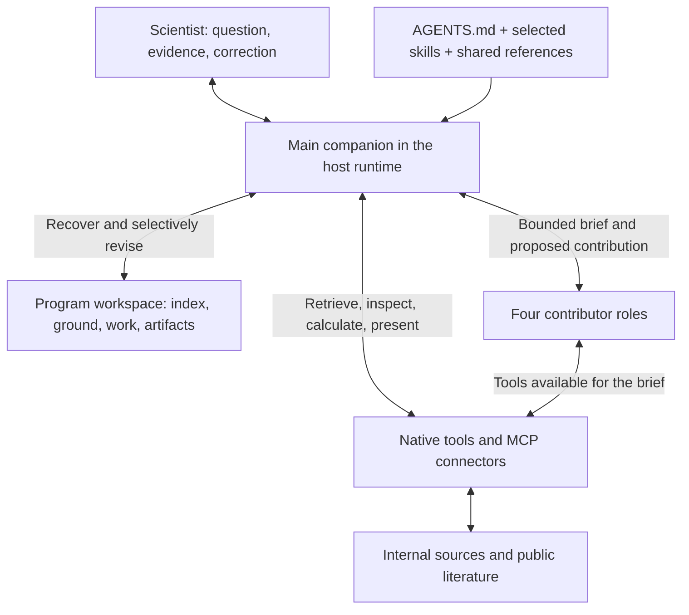
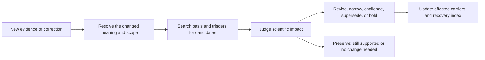

# Understanding the ICS Product Companion

A complete introduction for scientists, developers, and collaborators joining the
project. Read this guide in order to understand how the parts work together; use
the linked source files when you need their exact contracts.

The guide follows a scientific question through the system: how the companion
uses its instructions, skills, contributors, references, and tools to develop an
answer, and how useful program understanding is preserved for later work.

## Contents

1. [Purpose and scientific responsibility](#1-purpose-and-scientific-responsibility)
2. [Architecture and instruction loading](#2-architecture-and-instruction-loading)
3. [How a consultation develops](#3-how-a-consultation-develops)
4. [Scientific skills and brainstorming](#4-scientific-skills-and-brainstorming)
5. [Contributors and orchestration](#5-contributors-and-orchestration)
6. [Evidence, program state, and ICH guidance](#6-evidence-program-state-and-ich-guidance)
7. [Tools and retrieval](#7-tools-and-retrieval)
8. [Persistent program understanding](#8-persistent-program-understanding)
9. [A worked consultation and later update](#9-a-worked-consultation-and-later-update)
10. [Running the system](#10-running-the-system)
11. [How the system is evaluated](#11-how-the-system-is-evaluated)
12. [Repository map and first steps](#12-repository-map-and-first-steps)
13. [Glossary](#13-glossary)

## 1. Purpose and scientific responsibility

The ICS Product Companion is an ongoing scientific consultant for a
pharmaceutical program's **integrated control strategy**. It helps a team explain
how quality is controlled, examine what the evidence supports, investigate
concerns, compare changes, and decide which information would be useful next.

In this system, a control strategy is a connected scientific argument: for a
defined product and process, under particular conditions, why should the selected
collection of controls achieve and maintain the intended quality? A list of
specifications or passing tests is only part of that argument. The agent must
connect quality objectives, possible sources of variability, controls,
implementation, analytical capability, and actual evidence of performance.

The companion works with program documents, experimental results, process and
analytical data, scientific references, and the scientist's questions and context.
It connects that material into an explanation or assessment whose evidence and
reasoning the scientist can inspect, question, and develop further.

The agent can explain a control relationship, investigate an observation,
compare alternatives, recommend scientific priorities, or develop an evidence
plan. Its advice includes the basis, tradeoffs, uncertainties, and conditions
that would change the conclusion. Scientific advice supports the team's work;
formal approvals and changes to controlled records belong to the responsible
people and systems.

The pharmaceutical program is the continuity unit. A new conversation should be
able to build on qualified understanding from earlier work. The current design
uses **one program per prepared workspace**; multiple programs require separate
workspace boundaries. The included connector configuration selects `MK-6070`.

Source: [main agent contract](../AGENTS.md), especially §§1–5 and §§13–15.

## 2. Architecture and instruction loading

This repository is a **prepared agent workspace**. The host, `lc_factory` /
`ddt-agent`, supplies the model loop, sessions, native tools, and subagent
execution. This repository supplies the scientific instructions, contributor
definitions, references, MCP connectors, and program continuity conventions.
Together, the host and prepared workspace form the consultant.



The main companion integrates these inputs into one coherent scientist-facing
interpretation. Neither a tool result nor a contributor's completion flag owns
that interpretation.

| Layer | What it contains | How the design uses it |
| --- | --- | --- |
| [AGENTS.md](../AGENTS.md) | Identity, evidence discipline, composition, continuity, and authority boundaries | Always-active project instructions in the intended host |
| [.deepagents/skills/](../.deepagents/skills/) | Six skills for program outcomes, bounded evidence work, and requested exploration | Read when the responsibility is relevant; not all loaded for every question |
| [references/](../references/) | Detailed shared contracts, retrieval guides, ICH synthesis and source index | Open the relevant section when it bears on the work |
| [.deepagents/agents/](../.deepagents/agents/) | Four standalone contributor instruction files | Used for separately executed, bounded contributions |
| [.mcp.json](../.mcp.json) and [hooks configuration](../.deepagents/hooks.json) | Connector launch commands and hook registrations | Executable integration points consumed by the host |

In the documented host arrangement, each contributor's own file body supplies
its system prompt. Contributor files therefore carry essential boundaries and
pointers to the shared references they need. The parent supplies the specific
scientific assignment through the brief.

This loading structure keeps context focused. For a question about an unexpected
analytical result, the companion can open the concern skill and relevant
analytical guidance while leaving unrelated change or viral-safety detail aside.
The model composes the work from these instructions as the question develops.

## 3. How a consultation develops

Suppose a scientist asks, “Does our current strategy adequately control this
impurity, and what should we investigate first?” The companion should establish
the useful scope, recover relevant understanding, and examine the scientific
argument. The scientific need determines which sources and roles are useful.

A substantial consultation commonly involves the following judgments. Their
order and depth adapt to the evidence and the scientist's purpose.

1. **Understand the requested result.** An explanation, assurance assessment,
   concern investigation, and comparison of changes have different endpoints.
   Clarify product, process, method, time, or intended use when the answer could
   change; do useful work without waiting for an exhaustive intake.
2. **Recover relevant program context.** Read `PROGRAM.md`, select entries that
   could affect the answer, and check their scope, basis, and reconsideration
   triggers. Earlier reasoning is a starting position to requalify.
3. **Let the dominant scientific outcome lead.** For the impurity question,
   assurance assessment owns the overall answer. Reconstructing control logic or
   designing an informative comparison may contribute without taking over it.
4. **Identify the limiting uncertainty.** Missing records call for retrieval;
   unexamined data may call for analysis; a method blind spot calls for a
   capability assessment; possible anchoring may justify independent challenge.
5. **Integrate what the work establishes.** Resolve applicability and shared
   dependencies. Preserve material disagreement, alternatives, and limitations.
   The main companion judges what a contribution changes in the complete answer.
6. **Answer at the supported depth.** Lead with the conclusion and its scope,
   then explain the evidence, reasoning, advice, and remaining uncertainty.
7. **Decide whether anything should persist.** Save selected understanding,
   resumable work, or an independently useful product only when its purpose
   warrants it. A useful conversation need not create files.

Completion means scientific sufficiency for the requested purpose, or a precise
statement of what prevents a stronger answer.
An unresolved cause can still support useful advice about analytical capability
or a control dependency.
During explicitly requested brainstorming, a developed possibility or a sharper
question may itself satisfy the scientist's purpose.

Sources: [main contract §§4, 7–13](../AGENTS.md) and
[evidence-design skill](../.deepagents/skills/design-decision-changing-evidence/SKILL.md).

## 4. Scientific skills and brainstorming

A skill defines a scientific responsibility and the reasoning needed to fulfill
it. Four skills own program-facing outcomes; a fifth owns a bounded evidence
question. A sixth, brainstorm, owns explicitly requested scientific exploration.

| Scientist's question | Skill | Its distinctive reasoning and result |
| --- | --- | --- |
| “How does the control strategy work?” | [Establish control-strategy understanding](../.deepagents/skills/establish-control-strategy-understanding/SKILL.md) | Construct the qualified connection from quality intent and pathways through controls, execution, performance, analytical observability, and dependencies. Explain intended and demonstrated contributions separately. |
| “What assurance does it support; where should we focus?” | [Assess control-strategy assurance](../.deepagents/skills/assess-control-strategy-assurance/SKILL.md) | Compare what must be assured with what the demonstrated collection of controls supplies. Qualify potential gaps and, when requested, give scientific priorities or conditional preferences. |
| “What explains this unexpected observation?” | [Investigate a quality concern](../.deepagents/skills/investigate-quality-concern/SKILL.md) | Separate observation from embedded causal claims; maintain viable explanations, discriminating evidence, and their implications for control. A leading explanation need not be an accepted root cause. |
| “What does this change affect?” | [Assess change impact](../.deepagents/skills/assess-change-impact/SKILL.md) | Resolve the states being compared, find material and bundled changes, and examine evidence transfer claim by claim. Explain what holds, narrows, changes, or remains indeterminate; compare candidate controls when requested. |
| “What information would change our conclusion, and what do these results establish?” | [Design decision-changing evidence](../.deepagents/skills/design-decision-changing-evidence/SKILL.md) | Connect a material uncertainty to the smallest capable information-producing move, its prospective intent, actual execution, and bounded interpretation. Existing data or no additional work may be the right answer. |
| “Brainstorm with me; what assumptions or approaches could we rethink?” | [Brainstorm](../.deepagents/skills/brainstorm/SKILL.md) | Develop useful possibilities, counterfactuals and provisional positions with the scientist, including challenges to the framing. An unresolved idea can be useful while its assumptions and evidence remain explicit. |

The skills organize different kinds of scientific reasoning:

- **Understanding connects the control relationships.** It follows quality
  intent through sources of variability, selected controls, execution,
  performance, and measurement. For each control it distinguishes its documented
  purpose, applicability, implementation, operational performance, scientific
  contribution, and relationship to other controls.
- **Assurance examines both sides of the argument.** From the quality objective,
  it asks which pathways need protection and what must be observable. From the
  evidence, it asks what the implemented controls actually supply. Comparing
  those two accounts yields the supported assurance and any material potential
  gaps.
- **Concern investigation develops and tests explanations.** It characterizes
  the observation, identifies viable mechanisms and their predicted signatures,
  and examines which evidence discriminates among them. Explanations can compete,
  interact, or apply under different conditions. The result connects that
  explanatory picture back to relevant controls.
- **Change assessment examines transfer.** It resolves which states differ,
  including accompanying changes to methods or operating conditions. For each
  affected claim, it asks what prior evidence established and whether the new
  configuration preserves the conditions that evidence needs. The answer names
  both the changed and the unaffected relationships.
- **Evidence design connects intent to interpretation.** It identifies a
  conclusion that information could change, defines a capable comparison or
  observation, and explains the possible outcome meanings. When results arrive,
  it compares actual execution with the intended contrast and interprets what
  was established. Prospective plans, adaptations, and retrospective analyses
  remain distinguishable.

Composition follows the question. A method change during a quality investigation
may require change-impact reasoning, but the concern skill still owns the
explanation if that remains the scientist's main question. If evidence design
is asked directly, its bounded plan or interpretation can be the complete
endpoint; no larger assurance assessment needs to be invented.

For exploration, invoke `/skill:brainstorm <question>` in the intended host or
explicitly request brainstorming. The companion gives a promising idea room to
develop before requiring enough support for a conclusion. It can question a
program assumption, explore a cross-domain analogy, or express a provisional
preference and revise it after the scientist's objection. There is no required
number of hypotheses, search sequence, report, or experiment plan.

External science can introduce vocabulary or adjacent mechanisms, trace related
work, and expose conditions that strengthen or weaken an idea. Selected article
methods or tables may qualify an attractive abstract. The companion connects
those perspectives back to program conditions and keeps source claims, analogy,
and program evidence distinguishable. Retrieval is useful when it advances the
exploration; the available conversation may already be sufficient.

If the scientist asks, “How well does our evidence support that explanation?”,
the companion follows that narrower purpose. Concern investigation or another
skill becomes central when its complete responsibility is needed. Evidence
discipline remains continuous across the transition. A saved exploratory idea
retains its scope, assumptions, basis and objections; recovery adds no certainty.

## 5. Contributors and orchestration

Contributors are separately executed agents. Use one when separate execution
adds something useful: substantial bounded ownership, separate context,
parallelism, specialist depth, or cognitive independence.

| Contributor | When separate execution helps | What returns to the main companion |
| --- | --- | --- |
| [Scientific contributor](../.deepagents/agents/scientific-contributor/AGENTS.md) | A substantial evidence lane, control relationship, explanation, state difference, or analysis needs bounded scientific ownership | A scoped scientific contribution, with basis, reasoning, dependencies, and limits |
| [Specialist contributor](../.deepagents/agents/specialist-contributor/AGENTS.md) | The question needs focused domain or quantitative depth, defined by the brief | A specialist judgment within the supplied technical conditions |
| [Independent challenger](../.deepagents/agents/independent-challenger/AGENTS.md) | The interpretation may be anchored, overextended, or missing alternatives | Grounded challenges or an independently reconstructed interpretation, including its own limits |
| [Retrieval contributor](../.deepagents/agents/retrieval-contributor/AGENTS.md) | Reading many documents would displace the parent's scientific reasoning context | Candidate records and what their permitted contents report, with provenance and retrieval limitations; final scientific qualification stays with the parent |

A useful brief states the parent purpose, precise contribution, program scope
and time, starting evidence, relevant alternatives, applicable guidance,
constraints, expected result, and completion boundary. Contributors need enough
context for their role, rather than the entire conversation by default.

The challenger has two profiles. An **informed critic** receives the proposed
interpretation and examines it. An **independent reconstructor** receives the
question and qualified evidence without the parent's preferred conclusion.
The actual contents of the brief determine which profile is possible. A
reconstructor must also avoid the parent's program workspace conclusions;
withholding them from the brief alone is insufficient when files remain readable.
The contributor instructions explicitly preserve that separation.

Every return is a proposal. The parent can adopt it, adopt a narrower version,
use it as a correction, retain an alternative or dissent, hold it for resolution,
or decline it. Agreement is not new evidence and disagreement is not decided by
voting. Tool access and completion do not give a contributor authority to update
program conclusions or controlled state.

For example, a specialist brief might ask: “Assess whether method M2 can support
the F1/F2 aggregate comparison, using the supplied capability and crossover
records. Return what the comparison establishes, unresolved measurement
dependencies, and the observation that would most change your assessment.” The
parent then judges how that bounded answer affects the broader concern.

The design reserves durable program writes for the main companion after
integration. This ownership rule is part of the contributor instructions and
review process; the runtime hook is described in [section 10](#10-running-the-system).

## 6. Evidence, program state, and ICH guidance

The scientific discipline can be understood through three questions:

- **Source:** Which record, version, origin, and locator do we have?
- **Evidence:** What does it actually show, under which methods and conditions?
- **Use:** Can it support this proposition for this configuration and purpose?

An executed record can establish that a control was performed. A passing
measurement can establish that a result met its criterion. The scientific
contribution of that control to a quality outcome still needs an argument.
Similarly, three reports derived from one study do not provide three independent
confirmations. The agent should trace common origin and shared dependencies.

Program state also matters. Proposed, approved-but-not-implemented, implemented,
actually operated, and historically documented configurations are different.
If a supplier change is only proposed, its implications are conditional; the
agent must not describe affected lots as having been manufactured.

“Current” is resolved for the question. The newest document, the actual operating
configuration, the strongest scientific interpretation, and the suitability of
an old analysis for a new use are distinct. The design has no universal stored
`current` or `approved` flag that settles these questions.

Absence deserves particular care: inaccessible, not retrieved, searched but not
found, not measured, and not detected all mean different things. A search zero
does not establish scientific absence. A negative experimental finding needs
appropriate opportunity, sampling, timing, and analytical capability before it
can challenge a proposed mechanism.

These contracts live in [evidence and epistemic discipline](../references/evidence-and-epistemic-contract.md)
and [program state and currentness](../references/program-state-and-currentness.md).

### ICH quality guidance

The [local guidance synthesis](../references/control-strategy-guidance.md)
connects selected ICH principles to these scientific questions. The
[source index](../references/ich-source-index.md) identifies official editions,
sections, and links to FDA-hosted final documents.

| Scientific topic in the local synthesis | Principal ICH references selected there |
| --- | --- |
| Product/process understanding and collective controls | Q8(R2), Q11, Q6B |
| Risk reasoning, priorities, and alternatives | Q9(R1) |
| Analytical development and intended-use capability | Q2(R2), Q14 |
| Applicable manufacturing-change comparisons and lifecycle changes | Q5E, Q12 |
| Lifecycle knowledge and viral-safety contributions | Q10, Q11, Q5A(R2) |

The agent selects from this reference set according to product type, drug
substance versus drug product, development stage, question, and jurisdiction
where material. That applicability step helps it use the relevant principle
without treating every described approach as universally required.

Guideline principles help frame the scientific questions and comparisons.
Program records establish the applicable commitments, implementation, and
performance. The companion identifies the principle used and explains how it
applies to the program evidence. Regional requirements and separately issued
FDA-specific guidance are identified as such.

When exact wording or regulatory implications matter, use the identified official
text through available official-site access or a known local copy. Record what
was actually inspected and the edition/section used. Material guidance used in
durable reasoning belongs in that object's existing basis and reconsideration
logic, keeping scientific rationale and its guidance basis together.

## 7. Tools and retrieval

Tools provide access, computation, representation, or an exact operation. The
companion interprets their results for the scientific question.
Native host tools handle files, search, Git, calculations, authoring, and views.
Two repository-owned MCP servers provide four domain-facing tools.

### Internal program material: MUSE

[ics-muse](../tools/ics_muse/server.py) searches internal sources and helps the
companion identify and inspect the records relevant to a program question.

| Tool | Responsibility |
| --- | --- |
| `muse_population` | Define or narrow a program-scoped population; report records, counts, distributions, and execution/coverage qualifications |
| `muse_read` | Read selected documents identified by retrieval or an earlier document reference, preserving access and text limitations |

The intended retrieval pattern is to inspect population shape, narrow using
represented values, and read selected pivotal documents. Finding a document and
reading its contents are separate decisions. Conditions use field roles such as
title or status; the connector maps those to each source's fields. Program scope
is injected from configuration rather than exposed as a removable model argument.

The included scope configuration covers `meds`, `mmdkx`, `kneat`, `med_comms`,
`mrl_slides`, `scited`, `teamspace`, and `signals`. These represent different
record systems: controlled documents, technical knowledge, validation records,
communications, slides, publications, governance material, and notebook records.
Their identity and status fields need not have the same meaning. The documented
`signals` boundary is broader than the exact program and needs record-level
relevance checks; `kneat` uses startup-derived folder-prefix scope.

Population handles carry a retrieval recipe for reuse. The companion interprets
the returned scope, filters, dates, count basis, and coverage each time it uses
one; the handle itself represents neither an immutable dataset nor a scientific
conclusion.

Authentication failure, pre-execution refusal, partial retrieval, and an executed
zero result must remain distinguishable. Rankings belong to their source and
query; pooling multiple searches does not create a global relevance ranking.

Details: [MUSE guide](../references/muse-search-guide.md),
[scope configuration](../config/program-scope/MK-6070.yaml), and
[authentication documentation](../auth/README.md). Actual validated mappings and
per-call results describe the scope represented by a retrieval.

### Public scientific context

[ics-public-science](../tools/ics_public_science/server.py) exposes four operations:
search one chosen index, qualify one exact record, discover explicit article
relationships, and selectively read available article XML. Search preserves
controlled queries by default and offers explicit native provider syntax.
Exact records can include indexing, publication types, dates, funding, access
and integrity relationships; DOI resolution is within the chosen index.
Article outlines provide section/table locators tied to retrieved XML by a hash.
Table reads preserve their headers, spans, captions and footnotes together.

Its sources are PubMed and Europe PMC, with Europe PMC search restricted to MED
and PMC collections. Their rankings remain separate. When literature discovery
is needed for assurance or an absence-sensitive question, both indexes are
searched independently. Qualified existing evidence can make new discovery
unnecessary. Official ICH text uses its separate source index and access route.

Public literature can help the agent discover overlooked mechanisms, measurement
effects, dependencies or boundary conditions as well as investigate an existing
hypothesis. The agent selects useful leads, examines applicability against the
program's conditions and evidence, and revises the scientific account where
justified. Methods or tables may narrow a promising abstract. Public literature
cannot demonstrate the program's actual implementation or establish its cause.

Every external request discloses its query or identifier. The connector has
disclosure preflight checks, and the agent must respect permitted use rather
than send confidential program text to public services. A blocked request must
not be evaded through disguised versions of the same terms.

The [public retrieval guide](../references/external-source-search-guide.md)
defines request fields, continuation behavior, result states, and limitations.

## 8. Persistent program understanding

Persistence helps the consultant avoid rebuilding discovery and scientific
understanding from scratch at every consultation. It preserves selected meaning
and its basis so later work can recover, challenge, and deepen it. It is broader
than a search cache and more selective than saving every conversation.

The v1 convention is:

```text
workspace/programs/<program>/
├── PROGRAM.md     program coordinate, typed identifiers, scope limits, recovery index
├── ground/        selected scientific meaning useful for future program work
├── work/          scientific position needed to resume an evolving engagement
└── artifacts/     identifiable work products for defined independent uses
```

This layout describes the program continuity conventions. Its contents develop
through the scientific work the companion selects for preservation.

### What each object is for

| Form | What it should preserve | Example purpose |
| --- | --- | --- |
| `PROGRAM.md` | Program coordinates and a compact recovery index: name, meaning, scope, triggers | Decide which prior impurity assessment or method limitation to open |
| Ground | A bounded scientific meaning, qualified by evidence, applicability, uncertainty, and dependencies | “This clearance interpretation holds under the characterized input and process conditions” |
| Work | Purpose, starting basis, current position, live alternatives, unresolved evidence, integrated contributions, corrections, and useful next step | Resume an investigation awaiting an analytical-capability result |
| Artifact | A composed rationale or plan with an independent audience or use | A control-strategy assessment for team discussion |
| View or projection | A presentation of identified underlying meaning | A diagram or briefing drawn from that assessment |

The forms can be used independently or together. An artifact may already carry enough
continuity to make a separate work file redundant. A view does not create new
scientific support; if it adds a material interpretation, that addition needs its
own scientific qualification.

The design calls for one primary durable carrier for a bounded body of meaning
in a given role and scope. Other products reference it rather than maintaining
synchronized copies of the same conclusions. Ground entries remain discrete,
while an artifact can compose the rationale needed for its defined assessment
or audience. The workspace contract leaves the carrier for a continuously
maintained integrated program account unspecified; the ground entries and
bounded artifacts described here are the defined forms.

### Saving and recovering

For ground entries and artifacts, the current frontmatter convention has three
keys: `scope`, `basis`, and `triggers`. Scope states the relevant difference from
the program coordinate; basis contains links to what the meaning rests on;
triggers identify changes that should cause reconsideration. Further scientific
detail belongs in the prose. Names are meaningful kebab-case identifiers;
`[[entry-name]]` is the defined internal citation convention. File search lets
the companion locate named entries and references to them.

Saving selected meaning requires preserving the claim and its support. “Our
report concluded X” is circular if the report merely contains the same inference.
A useful entry instead says what holds, under which conditions and evidence,
with which limitations, and points to the complete rationale where appropriate.
The main companion also maintains the recovery index so later work can find it.

On recovery, the companion should:

1. Read the index and select material that could affect the present answer.
2. Check scope and intended use against the new question.
3. Inspect the basis and ask whether recorded triggers or dependencies changed.
4. Keep past inference labeled as inference and distinguish it from source data.
5. State what was actually used and what could not be recovered.

Recovery combines file inspection with scientific judgment. The index makes
potentially useful understanding discoverable; scope, basis, and triggers help
the companion decide whether and how to reuse it. Runtime checkpoints preserve
session execution separately from this scientific continuity.

### Correction and change over time

A correction can affect a source value, a method interpretation, program scope,
or a scientific assumption. The agent must first determine which layer changed,
then reconsider the dependent reasoning. Merely changing a sentence while
leaving its now-unsupported conclusion is insufficient.



Search identifies candidates; scientific judgment determines which conclusions
are actually affected. Supersession is scoped: newer meaning replaces earlier
meaning for a particular configuration, use, and time, for a stated reason.
Historical meaning remains available and may still apply elsewhere.

Living content is edited in place. Git is the v1 byte-level revision mechanism
for committed states, while the entry explains the scientific meaning of a
material change. Together they preserve the earlier wording and why the
interpretation evolved. The companion resolves current applicability from that
history and the available evidence.

Sources: [workspace and materialization](../references/workspace-and-materialization.md)
and [correction and dependency-aware revision](../references/correction-and-dependency-aware-revision.md).

## 9. A worked consultation and later update

This fictional example follows an impurity-control question and a later supplier
change. Its records and numerical inputs come from the
[Cedar packet](../evals/fixtures/ich-guidance/g1-upstream.md) and its
[follow-up](../evals/fixtures/ich-guidance/g1b-input-change.md).

### First consultation

The scientist asks whether absence of impurity X from routine release testing
is itself a weakness. The packet supplies:

- A quality rationale accepting X at or below 10 fictional units, assigning its
  control to purification with incoming X no higher than 100 units.
- Process-representative characterization covering incoming X from 20 to 100
  units and the permitted operating range, producing 1–4 units after purification.
  Analytical capability and no downstream introduction under the represented
  process are stipulated.
- Executed surveillance for three lots: incoming values 40, 55, and 60 units;
  post-purification values 2, 3, and 2 units, with operating conditions in range.
- An unchanged process/method state and no recorded commitment to routine
  release testing for X.

The compound request involves understanding and assurance. The main companion
lets assurance own the assessment, using the constructive control relationship
to explain how the strategy works. It examines the quality proposition and the
demonstrated protection together. Relevant local ICH guidance helps frame the
collection of controls; the packet supplies the criterion and evidence.

The supplied records let the companion examine this bounded question inline.
It can seek a contributor if the assessment benefits from a separate scientific
contribution or challenge.

A supportable answer would explain that absence from the routine release panel
is not itself a demonstrated weakness for X under the represented conditions.
It would identify the purification and input boundary as material dependencies,
explain the combined characterization and executed evidence, and restrict the
conclusion to this impurity, process, and evidence envelope. Passing unrelated
release tests would add no direct evidence about X.

An illustrative scientist-facing answer is:

> The supplied evidence supports the X-control relationship for P1 at S1 within
> the characterized input and operating conditions. The support comes from
> representative purification characterization, capable measurements, and the
> executed lots. The key dependency is that incoming X and the process remain
> within that evidence envelope. A supplier/input or method change should reopen
> the assessment. These records do not make a separate routine release test for
> X necessary by themselves.

### Selective persistence

If the scientist wants to reuse this understanding, the companion could preserve
one discrete ground entry named `impurity-x-control-boundary`. Illustrative
content would include:

| Element | Meaning to preserve |
| --- | --- |
| Scope | Cedar process P1 at site S1, impurity X, represented input/operating conditions |
| Basis | Identified records C1 revision 3, C2 revision 2, C3 revision 1, and the C4 state check, with their actual source locators when available |
| Scientific meaning | The represented control contribution and why a separate release test is not established as necessary by these inputs |
| Limitations | No extension to other quality attributes or unrepresented input/process conditions |
| Triggers | A material supplier/input, process, downstream, method-capability, or contrary-evidence change |

The recovery index would include the entry's name, scope, meaning, and triggers.
If a team-facing assessment is requested, an artifact could carry the composed
rationale and the ground entry could reference that carrier without treating its
conclusion as independent evidence. A separate work file is useful only if an
ongoing question needs continuity.

### Later consulting update

The scientist returns with a **proposed** incoming-X condition of 140 units for
future lots. No above-100 characterization or affected-lot evidence is supplied.

Now change-impact reasoning leads. The index and entry expose the input-boundary
dependency. The agent can recover the earlier position without repeating all
discovery, then requalify its reach. The past assessment may remain supported
for the original conditions; it does not establish performance at 140 units.
The proposed condition has not become an actual manufacturing state.

Useful next clarification concerns what input condition is truly proposed and
whether existing applicable data address that challenge. If they do not, the
evidence-design skill can identify a capable contrast and the inputs still needed
to define it. The agent should not invent a sample size, declare failure, or
automatically demand routine release testing. Persistent updates would record
the narrowed transfer and unresolved future-condition question while preserving
the historical basis.

This is the purpose of continuity: retain the useful scientific position and
reconsider the part changed by new information.

## 10. Running the system

The complete launch procedure is in [RUNNING.md](../RUNNING.md). The repository
expects an existing `ddt-agent` host and `uv`; connector scripts declare their
dependencies through PEP 723 metadata. `uv` resolves those dependencies as needed.

Before an authorized connected session, the operating setup needs these pieces:

1. Launch from the prepared repository root so project instructions, skills,
   contributors, and configuration are discovered in the intended context.
2. Set both `.mcp.json` commands to the intended checkout and `uv` executable,
   with `logs/` available for their stderr output.
3. Confirm the selected program, its scope configuration, and its `PROGRAM.md`
   coordinate agree, so retrieval and continuing understanding refer to the same
   program.
4. For MUSE, use the documented session-capture mechanism. Credentials belong
   outside the repository and should not enter scientific artifacts or logs.
5. Follow the host's project-MCP trust procedure and use Manual approval as
   documented. Confirm a small actual agent-side tool invocation to check that
   the connector reached the agent's runtime.

During a session, the host executes tool calls and dispatches contributors; the
companion supplies the scientific purpose and interprets their returns. Hook
registrations connect local checks to host tool events. File tools and Git support
the selective persistence and recovery described earlier.

[The hook configuration](../.deepagents/hooks.json) invokes
[the durable-content guard](../hooks/durable_content_guard.py) for
`PreToolUse` and `PermissionRequest` events. It checks recognized frozen-path
mutations and otherwise leaves the decision to ordinary host approval. These
textual checks are limited protection against accidental modification; they do
not enforce contributor identity or reconstruction independence. Those rely on
the role instructions, briefs, and review of contributions.

## 11. How the system is evaluated

There are distinct questions to verify. A connector harness, a prompt exercise,
and a realistic scientist session answer different ones.

| Layer | Existing material | What it can establish when actually run |
| --- | --- | --- |
| Connector behavior | [Contract suite](../tools/contract_map_check.py), individual `*_check.py` harnesses, [mutation gate](../tools/mutation_gate.py) | Local behavior under the test inputs and the checks' ability to detect selected faults |
| Authentication/live access | [Auth tests](../auth/test_muse_session.py), [MUSE live contract check](../tools/muse_contract_check.py), [MCP probe](../tools/mcp_probe.py) | Their particular authentication, transport, or live-contract observations under the tested environment |
| Core scientific behavior | [Core fixtures](../evals/fixtures/core-behavior-fixtures.md) | Manually assessed behavior for scope, evidence, revision, authority, and related contracts |
| ICH-informed consulting | [ICH packets and setup](../evals/fixtures/ich-guidance/README.md), separate [reviewer rubric](../evals/fixtures/ich-guidance/reviewer-rubric.md) | Whether the evaluated agent reasons appropriately from the supplied synthetic evidence |
| Scientific brainstorming | [Conversation packets and setup](../evals/fixtures/brainstorm/README.md), separate [reviewer rubric](../evals/fixtures/brainstorm/reviewer-rubric.md) | Whether requested exploration develops useful ideas, responds to corrections, uses external perspectives appropriately, and transitions without inflating support |
| End-to-end consultation and continuity | Host execution with realistic allowed evidence, tool traces, and resumed work | Actual routing, context handling, integration, persistence, and scientist-facing usefulness in that run |

The core fixtures cover the five skills along with evidence handling, retrieval
failures, disclosure, contributor integration, and correction. The ICH fixtures
exercise control contributions, analytical capability, alternative controls,
development-stage applicability, and comparability. Paired cases change a
material input so reviewers can examine whether the answer changes for the right
reason.

The separate reviewer rubric evaluates the link between evidence and answer.
Good performance includes explaining what is supported, making a useful
conditional recommendation, identifying what would change it, and selecting
proportionate further work. A model should be capable of both a supported
favorable conclusion and a precise unresolved result.

Use [evals/README.md](../evals/README.md) for evaluation procedures and
[RUNNING.md](../RUNNING.md) for check commands and prerequisites. Scientific
fixtures have manual review instructions; their presence is separate from an
execution result. Record the tested revision, inputs, environment, and observed
behavior when evaluating a candidate.

## 12. Repository map and first steps

| Location | What a newcomer should look for |
| --- | --- |
| [README.md](../README.md), this guide, [RUNNING.md](../RUNNING.md) | Orientation, the connected explanation, and operational setup |
| [AGENTS.md](../AGENTS.md) | Main companion's complete scientific operating contract |
| [.deepagents/skills/](../.deepagents/skills/) | Outcome definitions, characteristic reasoning, composition, completion boundaries |
| [.deepagents/agents/](../.deepagents/agents/) | Standalone contributor instructions and return expectations |
| [references/](../references/) | Shared evidence/state/persistence/revision/authority contracts, ICH references, retrieval guides |
| `workspace/programs/<program>/` | Program-specific continuity when present; not application source or a generic test fixture |
| [config/program-scope/](../config/program-scope/) | Program/source mappings used by the internal connector |
| [tools/ics_muse/server.py](../tools/ics_muse/server.py) | MUSE startup scope/cache handling, request planning, record/count assembly, population and document tools |
| [tools/ics_public_science/](../tools/ics_public_science/) | Public server entry points, query validation, disclosure checks, adapters, normalization, response contracts |
| [auth/](../auth/) | Session capture/check/keepalive implementation and its tests |
| [hooks/](../hooks/), [.deepagents/hooks.json](../.deepagents/hooks.json), [.mcp.json](../.mcp.json) | Local hook implementation and runtime integration configuration |
| [tools/](../tools/), [evals/](../evals/) | Developer checks and scientific behavior scenarios; inspect prerequisites and evidence limits |
| [communication/](../communication/README.md) | Existing HTML overviews and diagram sources; useful presentations that may lag newer contracts |
| [PIPER.md](../PIPER.md) | How source ownership relates to the separate Piper Station development hub |

**For a scientist:** follow this guide with one skill matching a real question,
then the relevant ICH synthesis section. A useful first exercise is the Cedar
packet: explain the relationship between the claim, control, evidence, and
conditions that could change it.

**For a developer:** read the main contract, one skill and its contributor
boundaries, then trace the relevant tool from its `@mcp.tool` entry point through
request validation/planning and response assembly. Distinguish contract prose
from executable enforcement, and select checks for the behavior being changed.
You do not need to run live sources to understand these layers.

**For an evaluator:** select a fixed packet, keep its rubric and other answer
material out of the evaluated context, and record the candidate revision,
model/host, available tools, exact inputs, actual response, and limitations.
Evaluate useful affirmative conclusions and justified restraint together.

Piper Station holds development coordination records separately from the
product's scientific workspace. See [PIPER.md](../PIPER.md) for that development
arrangement.

## 13. Glossary

| Term | Meaning in this project |
| --- | --- |
| ICS | Integrated control strategy: the scoped scientific argument linking intended quality to a justified collection of controls |
| Companion / parent | Main scientist-facing agent that integrates contributions and owns selective program continuity |
| Skill | Instructions for a scientific outcome or bounded evidence responsibility |
| Contributor / subagent | Separately executed agent with a bounded brief; its return is a proposal for integration |
| Program coordinate | The product/process/method/site/time dimensions material to the question, with typed program identifiers |
| Assurance proposition | The particular quality-related claim the assessment asks the controls and evidence to support |
| Ground | Selected qualified scientific meaning preserved for future program reasoning |
| Work | A saved scientific position needed to continue an engagement |
| Artifact | An identifiable scientific work product for an independent use or audience |
| Basis | Sources and other identified support on which a meaning rests, with their claim types preserved |
| Trigger | A stated change that should prompt reconsideration of an entry |
| Requalification | Re-examining whether recovered evidence or reasoning remains applicable and sufficient for the present use |
| Supersession | Replacing the reach of earlier meaning for a stated scope/use/time, while retaining historical context |
| MCP | Model Context Protocol, used here to expose connector tools to the host |
| MUSE | Internal search/discovery layer over program sources; not itself the authoritative scientific record |
| ICH | International Council for Harmonisation; the selected Q-series documents inform the system's scientific guidance |
| DS / DP | Drug substance / drug product |
| CAPA | Corrective and preventive action; formal organizational activity the companion does not initiate or close on its own |

Maintain this guide when a linked contract or mechanism changes. Keep technical
behavior authoritative in its implementation, scientific operating instructions
in their existing files, and verification claims attached to actual evidence.
